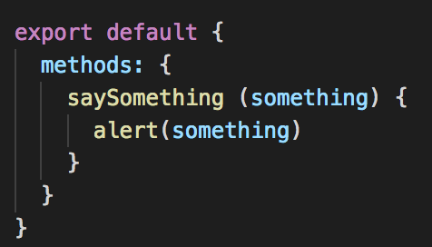

## Prerequisites
- Node.js and npm installed
- Knowledge of HTML/CSS
- Knowledge of Javascript

## Used Editor
**Visual Studio Code** <br>
See [official website](https://code.visualstudio.com/) for installation

#### Recommemded extensions in VSCode
- Vetur (for Vue)
- ESLint
  - To use this package properly, check [this link](https://alligator.io/vuejs/eslint-vue-vetur) for more detail.
- Auto Close Tag
- Auto Rename Tag
- GitLens

## Setup and Installation
#### Vue CLI
Install Vue CLI (Vue Command Line Interface)<br>
```text
npm install -g @vue-cli
```
Then, we can now start using `vue` command. <br>
Use `vue` to check the version:<br>
```text
vue --version
```
#### Create a project
2 ways by using `vue` to create a new project
- Use command line
```text
vue create <project_name>
```
- Use GUI
```text
vue ui
```

The settings in this tutorial:

#### Start a local server
Move to the project folder and use the following command to run the dev server.
```text
npm run dev
```
When running the dev server, [hot-reload](https://vue-loader.vuejs.org/guide/hot-reload.html#state-preservation-rules) is enabled for a better development experience. <br>
Browse `http://localhost:8080/` to see the default page.

#### Project Structure
We can see a bunch of folders and files after the project created. Here we can just focus on those in `src/` folder.
- `views/`
  - The .vue files of all pages
- `component/`
  - The .vue files of the child components used in pages.
- `main.js`
  - Where the Vue instance is created and the whole App is rendred.
- `router.js`
  - Set routing and corresponding views
- `App.vue`
  - Define how the App looks like, and mounted in main.js.

## Getting Started
#### \<template\>, \<script\>, \<style\> in .vue
<br>
<!--  -->
- `<template>` - HTMLs
- `<script>` - data, methods, lifecycle hooks. (Basically javascript)
- `<style>` - CSS

#### Data Declaration
In `<script>`:


#### Methods
In `<script>`:


#### Conditional and Loop Rendering
`v-if` `v-else`: Render when the condition is satisfied

<br><br>
`v-for`: Repeat rendering until the condition is satisfied

> Words prefixed with `v-` indicate that they are special attributes provided by Vue.

#### Two-way Binding
`v-modal`: To create two-way data bindings on form input, textarea, and select elements.


### Start making a simple CRUD webpage
We want to make a webpage which can create, retrieve, update and delete to manage our project team members. We can simply add a new page to the project we just create.
1. Create a new page (`.vue`), let's say `Memebers.vue`
2. Add a new route for our page to be able to be visited.
<br> In `router.js`

Remember to import our component or you will get exception.

Now we can visit this page by visiting `/members`.<br>
Also we can add a link on our home page.<br>
In `App.vue`:

3.


#### lifecycle
#### event queue
[event queue](https://zhuanlan.zhihu.com/p/33090541)
[flush promises]()

#### 建議：看官方教學 for more details ＸＤ

#### img in /assets and /public
- use require or not
https://stackoverflow.com/questions/52082968/vue-js-2-vue-cannot-find-files-from-assets-folder-v-for

## Vue DevTools

## passing data between components
- parent to child
- child to parent
- state management
  - https://medium.com/fullstackio/managing-state-in-vue-js-23a0352b1c87
- vuex
  - 記得傳多個參數進去的時候要注意Ｑ＿＿＿＿＿＿＿＿＿＿＿＿＿＿＿＿＿＿＿＿＿＿＿＿＿＿＿＿＿＿＿＿＿＿＿＿＿＿＿＿＿＿＿Ｑ

## mixins

## Testing
#### Sinon, Mocha, Supertest
[sinon](https://medium.com/@yujiechen0514/sinon-js-%E7%9A%84-spies-stubs-%E5%92%8C-mocks-%E7%9A%84%E6%9C%80%E5%A5%BD%E5%AF%A6%E8%B8%90-%E8%AD%AF%E6%96%87-%E7%AD%86%E8%A8%98-f799538ffb64)
https://medium.com/@benlesh/debugging-typescript-mocha-tests-with-vscode-89310051531
#### Test async code (promise...) https://jestjs.io/docs/en/asynchronous.html
  - chai-as-promise
  - remember to return or the test will complete before the promise being returned
#### Test error thrown
  - normal -> https://www.chaijs.com/api/bdd/#method_throw
  - promise -> chai-as-promise

###### sandbox
###### spy or stub before function called (even mounted) is not allowed (bugggggg)
  - what if we wanna test method in mounted? https://github.com/vuejs/vue-test-utils/issues/1027
###### stub standalone function - Not allowed! https://stackoverflow.com/questions/32321149/sinon-spy-on-standalone-function

#### $router.push: don't check final path name since it returns a promise https://router.vuejs.org/zh/guide/essentials/navigation.html
  - 
#### setData vs "="
#### vuex
  - 記得用 fake store (有點像 localVue)
  - 注意會 reference 到同一個

#### configuration in VSCode for debugging during test

## vue-i18n
#### installation
#### adding locale
#### adding string
#### Use in template, script, js
- v-html
- placeholder, label, etc. -> v-bind
- format `($t('__name', '{ key: ... }'))$`
#### good practice
https://dotblogs.com.tw/wasichris/2018/05/12/012517

## CSS
[selector game](https://flukeout.github.io/)
#### displayed view not the same as our expectation
refresh > clean cache and refresh > important > 大神們
#### grid layout <b-col> <b-row> <b-container>
cols="auto" -> 依據 view 的大小決定寬高度
#### 開發人員選項 （chrome -> 檢查）（快捷鍵）
- 直接改 style
- vue dev tool

#### bootstrap-vue 遇到的坑
1. b-Modal
- sizing
- custom class


#### max-width vs. width

#### 置中方法
1.
```
position: absolute; (parent should be relative(?))
left: 50%;
top: 50%;
transform: translate(-50%, -50%);
```
2.
```
margin: auto
```

## Nodejs
Event loop:
1. poll -> 會先執行完才會去看有沒有 timer 的程式要跑, 如果有 setImmediate(), poll 執行完就會先執行 immediate 的東西
2. setImmediate() vs. setTimeout()
