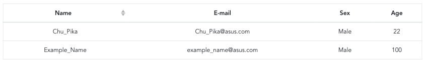

# Getting Started with Vue.js
***This tutorial is for Vue version 2.x***
## Prerequisites
- [Node.js and npm installed](https://www.taniarascia.com/how-to-install-and-use-node-js-and-npm-mac-and-windows/)
- Knowledge of HTML/CSS
- Knowledge of Javascript
- [DOM (link provided by Chenglin Yang)](https://ithelp.ithome.com.tw/articles/10202689)
- [MVVM (link provided by Chenglin Yang)](http://www.syscom.com.tw/ePaper_New_Content.aspx?id=498&EPID=219&TableName=sgEPArticle)

## What You Will Learn
- Knowing basic concepts of Vue.js
- Knowing a proper way to start a Vue project
- Building a webpage with CRUD functionalities

## What This Tutorial Does NOT Cover
- Backend CRUD Implementation
- CSS skills
- Testing

## Used Editor
**Visual Studio Code**  
See [official website](https://code.visualstudio.com/) for installation

#### Recommended extensions in VSCode
- Vetur (formatting code for Vue)
  - Then we can add [prettier config](https://prettier.io/docs/en/configuration.html#basic-configuration) for desired formatting
  - To format on save, add `"editor.formatOnSave": true,` in `setting.json` (the setting file for VSCode)
- ESLint (need not to worry if we use Vue CLI (introduced below) to create a project)
  - To use this package properly, check [this link](https://alligator.io/vuejs/eslint-vue-vetur) for more detail.
- Auto Close Tag
- Auto Rename Tag
- GitLens

## Setup and Installation
#### Vue CLI
Install Vue CLI (Vue Command Line Interface)<br>
```text
npm install -g @vue-cli
```
Then, we can now start using `vue` command. <br>
Use `vue` to check the version:<br>
```text
vue --version
```
#### Create a project
2 ways by using `vue` to create a new project
- Use command line
```text
vue create <project_name>
```
- Use GUI
```text
vue ui
```
Example settings:

> If we don't use history mode, character "#" will show up in our urls.  
> Once we use it, some settings are needed on server side when get deployed. But need not to worry to build a local one as in this tutorial.

#### Start a local server
Move to the project folder and use the following command to run the dev server.
```text
npm run serve
```
When running the dev server, [hot-reload](https://vue-loader.vuejs.org/guide/hot-reload.html#state-preservation-rules) is enabled for a better development experience. <br>
Browse `http://localhost:8080/` to see the default page.

#### Project Structure
We can see a bunch of folders and files after the project created. Here we can just focus on those in `src/` folder.
- `views/`
  - The .vue files of all pages
- `component/`
  - The .vue files of the child components used in pages.
- `main.js`
  - Where the [Vue instance](https://vuejs.org/v2/guide/instance.html) is created and the whole App is rendred.
- `router.js`
  - Set routing and corresponding views
- `App.vue`
  - Define how the App looks like, and mounted in main.js.

> In `public/` folder, we can see `index.html` is generated, which is the root html file of our project.

## Basic concept
### \<template\>, \<script\>, \<style\> in .vue
<br>
<!--  -->
- `<template>` - HTMLs
- `<script>` - data, methods, lifecycle hooks. (Basically javascript)
- `<style>` - CSS
  - Use `<style scoped>` can limit the style only applied to this page

### Data Declaration
In `<script>`:\


### Methods
In `<script>`:\


### Mustache
`{{ }}`: Text / JS expression interpolation
```html
<p>Message: {{ msg }}</p> // msg will be replaced with its value
<p>{{ ok ? 'YES' : 'NO' }}</p>
<p>{{ number + 1 }}</p>
```

### Conditional and Loop Rendering
`v-if` `v-else`: Render when the condition is satisfied  
```html
<div id="sorting-hat">
  <p v-if="name === 'Harry Potter'">Gryffindor</p>
  <p v-else-if="name === 'Draco Malfoy'">Slytherin</p>
  <p v-else>Muggle</p>
</div>
```
<!--    -->
`v-for`: Repeat rendering until the condition is satisfied  
```html
<ul id="example">
    <li v-for="(item, index) in items">
        {{ item }}
    </li>
</ul>
```
<!--  -->
> Words prefixed with `v-` indicate that they are special attributes provided by Vue.

> We can directly show the defined variables in `{{ }}`, also some simple javascript logic is allowed. e.g., ternary operator

### 3 Important Directives
`v-on`: To attach event listeners that invoke methods on our Vue instances, e.g., on click, submit event.  
```html
<button v-on:click="onClick()"/>
```
`v-bind`: Dynamically bind one or more attributes.  
```html
<button v-bind:id="myId"/>
```
`v-model`: To create two-way data bindings on form input, textarea, and select elements.
```html
<input v-model="userInput"/>
```
We can see more clear examples during the implementation.

## Start making a simple CRUD webpage
### Requirement
We want to add a webpage which can **create, retrieve, update and delete** to manage our project team members in the project we just created before.

### Install BootstrapVue
To build our website more efficiently we use [BootstrapVue (BV)](https://bootstrap-vue.js.org/).  
For **installation**, use **Vue CLI** (instead of npm) to install or we will need to install other needed packages on our own.
```
vue add bootstrap-vue
```
> In this way, a `.js` is automatically generated in `plugins/` and imported in `main.js`; also, some other needed dev-packages are installed on its own. (For bootstrap-vue, we can see vue-cli-plugin-bootstrap-vue is also installed.)

To learn how to use it, just **search for the needed components in the official documents**, and follow the instruction step by step.  
> Tag prefixed with `b-` indicate that they are BV components.

### Adding a new path for our page
1. Create a new page (`.vue`), let's say `Memebers.vue`
2. Add a new route for our page to be able to be visited.  
In `router.js`  
```js
export default new Router({
  routes: [
    {
      path: '/members',
      name: 'members',
      component: Members
    },
    ...
})
```
<!--    -->
Remember to import our component or you will get exception.
```js
import Members from './views/Members.vue'
```
> [Components](https://vuejs.org/v2/guide/components.html#Base-Example) are reusable Vue instances with a name, and it's **recommened** to read the official document to learn more about it now or later.

<!--    -->
Now we can visit this page by visiting `/members`.<br>
Also we can add a link on our home page.<br>
In `App.vue`:  

>`<router-view>` will render all the components defined in `router.js` here.

### Add a form to enter the member's info
Try to use BV to build a form as below:  (Too many codes to show XD)
   
(Used BV components:
[Grid System](https://bootstrap-vue.js.org/docs/components/layout/#layout-and-grid-system),
[Form group](https://bootstrap-vue.js.org/docs/components/form-group/#form-group),
[Form input](https://bootstrap-vue.js.org/docs/components/form-input/#comp-ref-b-form-input),
[Form select](https://bootstrap-vue.js.org/docs/components/form-select/#form-select))

Now we can enter the information on the website, but how do we get the input values to do the further step -- `v-model` can help.
1. Add needed variables in `<script> data()`  
```js
data () {
  return {
    formData: {
      name: null,
      email: null,
      sex: null,
      age: null
    }
  }
},
```
<!--  -->
2. Add `v-model` property for the components, e.g., for the "name" column:  
```html
<b-form-input
    id="input-name"
    v-model="formData.name"
    placeholder="Chu_Pika"
    required
></b-form-input>
```
<!--    -->
In this way, the value of `formData.name` is bound to the user's input.
> We can simply add ```<p>{{ formData.name }}</p>``` and type something in the form to see the effect.

### Communicate with server (CRUD)
> For the server we use in this tutorial is https://yingweb.azurewebsites.net, which connects to a PostgreSQL database, and is able to handle CRUD requests to manipulate the database.  
We can directly visit the link to check current data in the database.

#### Retrieve
Let's show the database data on our website.
1. Add a table for display
```html
<b-table outlined hover :items="members" :fields="fields" align="center"></b-table>
```
(Used BV components:
[Tables](https://bootstrap-vue.js.org/docs/components/table/))
> Check [Fields (column definitions)](https://bootstrap-vue.js.org/docs/components/table/#fields-column-definitions) block to see the usage of fields

2. Add `getMembers` method  
Here we use package [axios](https://github.com/axios/axios) to make http request.
Remember to install and import the package before using it.  
```
npm install axios
```
```js
// In <script>
import axios from 'axios'
// constants of urls
const SERVER = 'https://yingweb.azurewebsites.net'
const ENDPOINT = SERVER + '/members'
export default{
    ...
}
```
Then we can make a get requrest with `axios`
```js
methods: {
    async getMembers () {
      const res = await axios.get(ENDPOINT)
      this.members = res.data
    }
}
```
3. To retrieve data once we visit the page  
Add the method in the `mounted` lifecycle hook, in this way, the method get called once the page is mounted. [More details about Vue  lifecycle](https://vuejs.org/v2/guide/instance.html#Instance-Lifecycle-Hooks)
```js
// same level as data() and methods
mounted () {
    return this.getMembers()
  },
```
Now refresh the webpage, and we will see the table shows up with DB data.


#### Create
1. Add a submit button with type `submit` in the form we built before, and call self-defined function to handle the submit event.  
```html
<b-form v-on:submit.prevent="createMember">
    ...
    <div class="text-center">
      <b-button type="submit">Submit</b-button>
    </div>
</b-form>
```
<!--  -->
> `.prevent` is an event modifier equal to `event.preventDefault()`. [More details in the official document](https://vuejs.org/v2/guide/events.html#Event-Modifiers)

2. Add `createMember` method  
```js
methods: {
    async createMember () {
      await axios.post(ENDPOINT, this.formData)
      this.resetForm() // self-defined method to set all the values of formData to be null
      return this.getMembers() // retrieve the latest data
    }
}
```

That's it, now we can create a member with the submit button.
<!--  -->

#### Delete
1. Add a field in the tabel to place the deletion button
```js
fields: [..., 'action']
```
  
2. Add a button in the table for deletion
```html
<b-table outlined hover :items="members" :fields="fields" align="center">
    <template v-slot:cell(action)="data"> <!-- for the field "action"-->
      <b-button @click="deleteMember(data.item.id)" class="mr-2" variant="danger"
        >Delete</b-button
      >
    </template>
</b-table>
```
- @ is the shorthand of v-on  
- Check [Custom data rendering](https://bootstrap-vue.js.org/docs/components/table/#custom-data-rendering) block to see how to add custom component in tables  
- `v-slot` is a directive to provide content to named slots. [See more details about v-slot](https://vuejs.org/v2/guide/components-slots.html#Slot-Content)

3. Add `deleteMember` method
```js
methods: {
    async deleteMember (index) {
      await axios.delete(`${ENDPOINT}/${index}`)
      return this.getMembers() // retrieve the latest data
    }
}
```
Now press the delete button to see the effect.

#### Update
1. Add a button in the table (in field 'action') for update
```html
<b-button @click="onUpdateClick">Update</b-button>
```
2. Here we use a modal to enter the update information
```html
<b-modal id="bv-modal-update" title="Update member's info" hide-footer centered>
    <b-form-input class="mb-1" v-model="updateData.name" placeholder="name"></b-form-input>
    <b-form-input class="mb-1" v-model="updateData.email" placeholder="email"></b-form-input>
    <b-form-input class="mb-1" v-model="updateData.sex" placeholder="sex"></b-form-input>
    <b-form-input class="mb-1" v-model="updateData.age" placeholder="age"></b-form-input>
    <div class="text-center mt-3">
      <b-button @click="$bvModal.hide('bv-modal-update'), updateMember(updateData.id)"
        >Sumbit</b-button
      >
    </div>
</b-modal>
```
3. Add `updateMember` method
```js
methods: {
    async deleteMember (index) {
      await axios.delete(`${ENDPOINT}/${index}`)
      return this.getMembers() // retrieve the latest data
    }
}
```
(Used BV components:
[Modals](https://bootstrap-vue.js.org/docs/components/modal/))  
4. Then in `onUpdateClick()` method:
```js
onUpdateClick (item) {
    this.$bvModal.show('bv-modal-update') // show modal
    this.updateData = Object.assign({}, item) // copy the item to be updated
}
```

## Conclusion
In this tutorial, we know how to build a simple CRUD webpage using Vue.js and BootstrapVue. This is just a quick start to work with Vue, and help you be able to read other existing projects with less pain (XD). To learn deeper, following the official guides or reading the front-end projects on github could help a lot.
