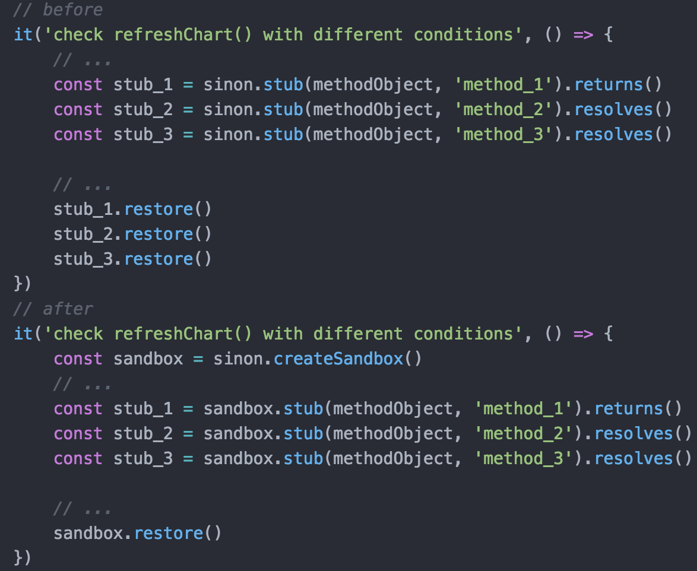
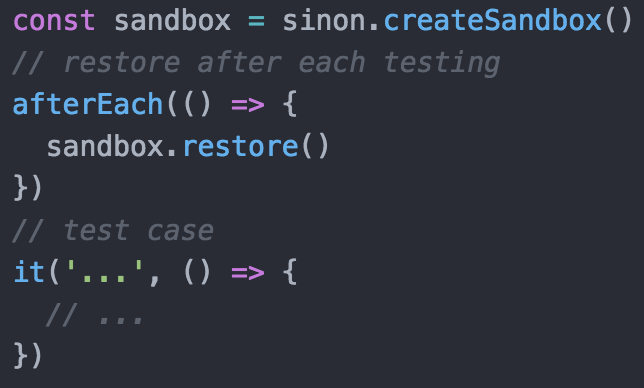
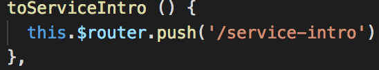
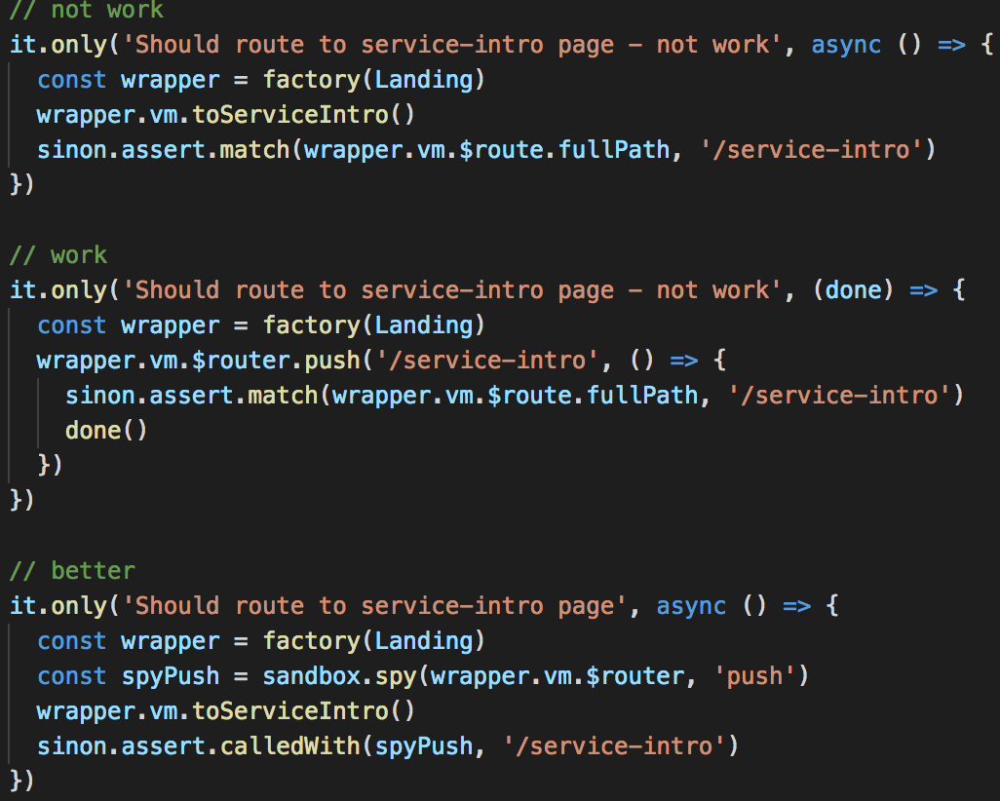
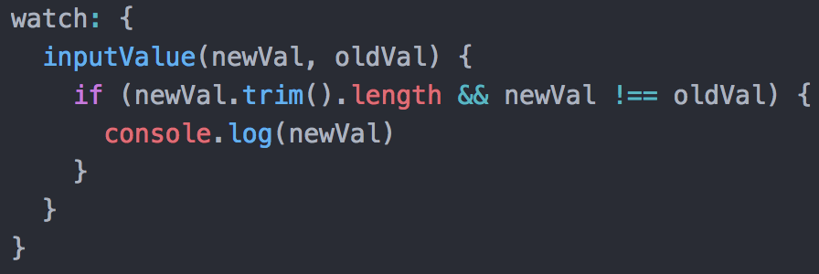
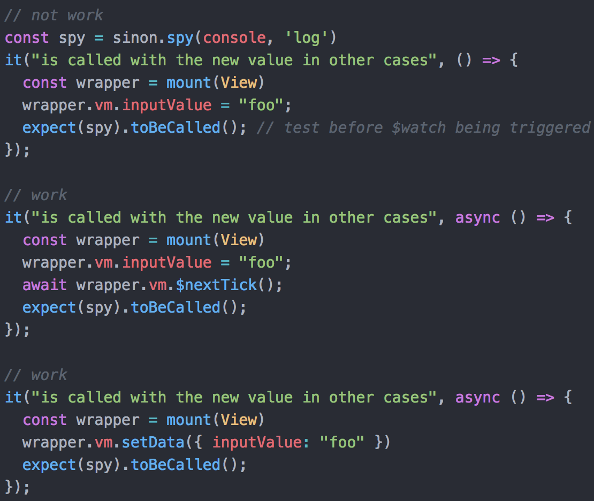
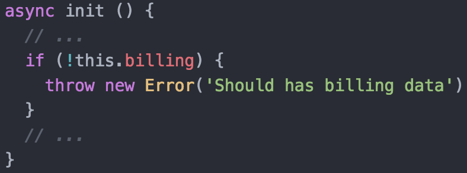
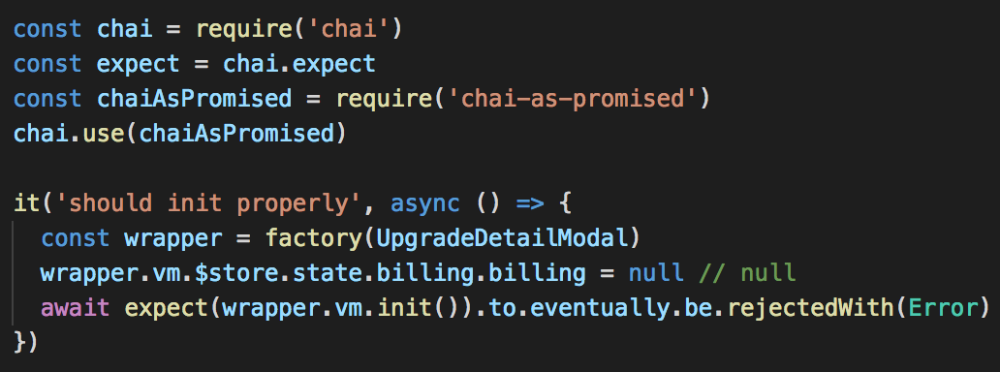

# Unit Test Tips for Vue.js

## Sinon: Sandbox
> Sandboxes removes the need to keep track of every fake created, which greatly simplifies cleanup.


<br><br>
When testing, we can do `sandbox.restore` in `afterEach` block:<br>


## Testing with vue-router
```
router.push(location, onComplete?, onAbort?)
```
> In 2.2.0+, optionally provide onComplete and onAbort callbacks to router.push or router.replace as the 2nd and 3rd arguments. ... In 3.1.0+, you can omit the 2nd and 3rd parameter and router.push/router.replace will return a promise instead if Promises are supported.

Assume we have a method:<br>
<br>
In testing:<br>
<br>
[Reference](https://router.vuejs.org/guide/essentials/navigation.html)

## $watch
Assume we wanna do something when `inputValue` changes:
<br>
In testing:<br>
<br>
More details:<br>
[Reactivity in Depth](https://vuejs.org/v2/guide/reactivity.html)<br>
[Vue.set definition](https://vuejs.org/v2/api/#Vue-set)<br>
[Reference](https://alexjover.com/blog/test-computed-properties-and-watchers-in-vue-js-components-with-jest/)

## chai-as-promise
Assume we wanna test error case:<br>
<br>
In testing:<br>
<br>
[Official website](https://www.chaijs.com/plugins/chai-as-promised/)
